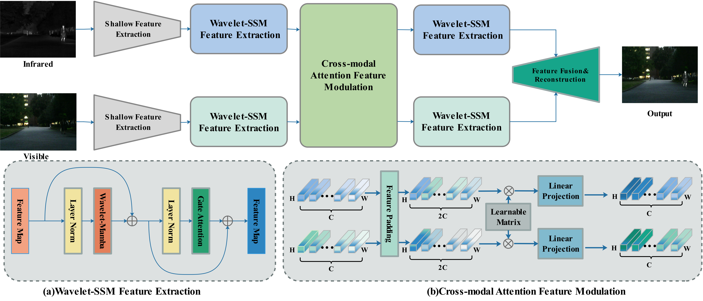
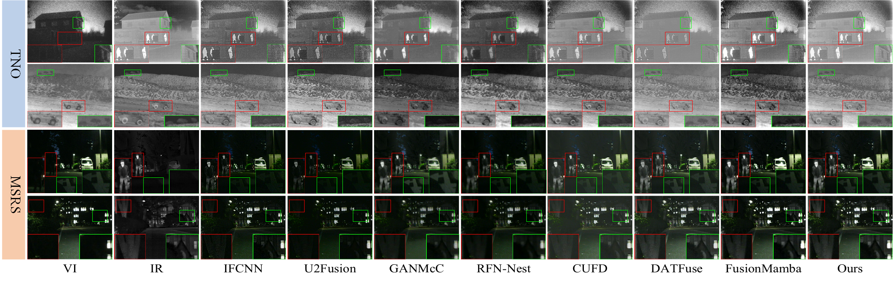
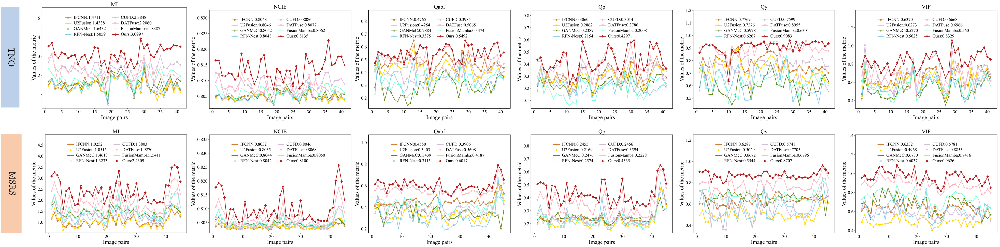

# [ICME 2025] Exploring State Space Model in Wavelet Domain: An Infrared and Visible Image Fusion Network via Wavelet Transform and State Space Model
### [Arxiv](https://arxiv.org/abs/2503.18378) | [Code](https://github.com/Lmmh058/W-Mamba) 

**Exploring State Space Model in Wavelet Domain: An Infrared and Visible Image Fusion Network via Wavelet Transform and State Space Model (ICME 2025)**



## Create Conda Environment

```bash
# - Create environment from yaml
conda env create -f environment.yaml

# - Activate
conda activate WMamba
```

## Prepare Your Dataset
The dataset used in this paper can be downloaded at:
[TNO](https://figshare.com/articles/dataset/TNO_Image_Fusion_Dataset/1008029) | [LLVIP](https://bupt-ai-cz.github.io/LLVIP/) | [MSRS](https://github.com/Linfeng-Tang/MSRS)

The images you use should be placed in:
```bash
    test_image/
                infrared/
                visible/
    train_image/
                infrared/
                visible/
```

## Pretrained Weights
Our pre-trained model is available at [Google Drive](https://drive.google.com/file/d/17j7baZJVsEko99_Rrcsv8YmRtsbtZPIH/view?usp=sharing).
After downloading, please place the pre-trained model in ```Model/Infrared_Visible_Fusion/models```.

## Testing
You can test the fusion performance of the model using the following command, after correctly placing the test images and the pretrained model:
```
python Test.py
```

## Visual Results
A few qualitative examples are shown below.



## Quantitative Results
Quantitative comparison examples are shown below. The red line denotes our method, and all metrics favor higher values.



## Training your own model
Put your training data in the ```train_image``` folder, and run:
```
python Train.py
```
Afterwards, your model will be placed in ```Model/Infrared_Visible_Fusion/models```.

## Citation
If our work contributes to your research, we would appreciate it if you could cite our paper:
```
@article{zhang2025exploring,
  title={Exploring state space model in wavelet domain: An infrared and visible image fusion network via wavelet transform and state space model},
  author={Zhang, Tianpei and Zhu, Yiming and Zhao, Jufeng and Cui, Guangmang and Zheng, Yuchen},
  journal={arXiv preprint arXiv:2503.18378},
  year={2025}
}
```
